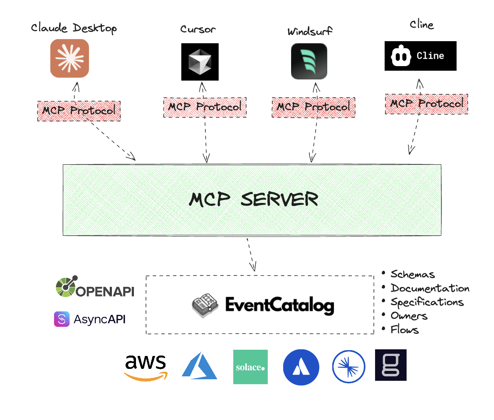

<div align="center">

<h1>📖 EventCatalog - MCP Server</h1>
<h3>Save time and money by getting insights from your EventCatalog directly from your MCP Client (<a href="https://www.anthropic.com/claude">Claude</a>, <a href="https://www.cursor.com/">Cursor</a>, <a href="https://codeium.com/windsurf">Windsurf</a>, etc)</h3>

<!--  -->



<h4>Features: Ask about domains, services and messages. Get answers in seconds. Request schemas, who owns what and much more.</h4>

[Read the Docs](https://www.eventcatalog.dev/docs/development/getting-started/introduction) | [View Demo](https://demo.eventcatalog.dev)

</div>
<hr/>

## Why EventCatalog MCP Server?

EventCatalog is an Open Source tool that helps you document your event-driven architecture.
Using EventCatalog you can document your domains, services and messages, schemas and much more.

Using the **EventCatalog MCP Server** you can get more value from your EventCatalog by asking questions about your architecture in the tools you already use.

Example questions:

- What events do we have in our architecture?
- Tell me more about the {service} service.
- I want to create a new feature that will send emails when a user signs up, what events do we have in our architecture that are related to user signups?
- Get me the schema for the event `UserCreated` in EventCatalog.
- Here is a new version of the `UserCreated` schema, what downstream consumers will be affected by this change?

Rather then digging through your architecture to find the answers you need, you can ask the MCP server directly from your MCP Client.

---

## EventCatalog MCP Features

- 🤖 Connect to any MCP Client ([Claude](https://www.anthropic.com/claude), [Cursor](https://www.cursor.com/), [Windsurf](https://codeium.com/windsurf), etc)
- 🤖 Run MCP server locally on your machine with one command
- 🤖 Connect to your EventCatalog instances
- 🤖 Ask questions about your architectures
- 🤖 Ask questions about your OpenAPI and AsyncAPI specifications
- 🤖 Ask about domains, services and messages, and much more
- 🤖 Get the schemas for events, queries, commands and services (OpenAPI, AsyncAPI, JSON Schema)
- 🤖 Ask questions about ubiquitous language for any domain and their entities

---

# Getting Started

## Installation

First, you need to enable the [`LLMS.txt` feature](https://www.eventcatalog.dev/docs/development/developer-tools/llms.txt) in your EventCatalog instance.

1. Enable the [`LLMS.txt` feature](https://www.eventcatalog.dev/docs/development/developer-tools/llms.txt) in your EventCatalog instance, by configuring your `eventcatalog.config.js` file.
2. Deploy your EventCatalog instance with the `LLMS.txt` feature enabled.

Next, you will need to get a EventCatalog Scale license key, you can get a 14 day trial license key from [EventCatalog Cloud](https://eventcatalog.cloud).

### Installing via Smithery

To install EventCatalog for Claude Desktop automatically via [Smithery](https://smithery.ai/server/@event-catalog/mcp-server):

```bash
npx -y @smithery/cli install @event-catalog/mcp-server --client claude
```

### Running as a Docker Container

If you want to run the MCP server as a standalone Docker container (for example, to run it as an HTTP server), see the [Docker Deployment Guide](./README.Docker.md).

This is useful for:
- Running the MCP server in production environments
- Deploying as a containerized service
- Running in HTTP mode for integration with multiple clients
- Kubernetes, Docker Swarm, or other container orchestration platforms

## Transport Modes

The EventCatalog MCP Server supports two transport modes:

### STDIO Mode (Default)
- Uses standard input/output for communication
- Ideal for local development and MCP clients like Claude Desktop and Cursor
- Started automatically when you add the server to your MCP client
- No port exposure needed
- **Recommended for**: Claude Desktop, Cursor, Windsurf, and other desktop MCP clients

### HTTP Mode
- Runs as an HTTP server on a specified port (default: 3000)
- Ideal for production deployments and container environments
- Allows multiple clients to connect to a single server instance
- Includes health check endpoints for monitoring
- **Recommended for**: Docker deployments, Kubernetes, production environments, and multi-client setups

To use HTTP mode, pass `http` as the transport parameter:
```bash
npx -y @eventcatalog/mcp-server {URL} {LICENSE_KEY} http {PORT}
```

Or set the `MCP_TRANSPORT` environment variable to `http` (see [Docker Deployment Guide](./README.Docker.md) for details).

## Setup MCP Clients

Each MCP client has a different way of adding the MCP server.

You can find some helpful links below to get started.

- [Claude Desktop](#adding-the-mcp-server-to-claude-desktop)
- [Cursor](#adding-the-mcp-server-to-cursor)

## Adding the MCP server to Claude Desktop

To use this with Claude Desktop, add the following to your `claud_desktop_config.json` file. The full path on MacOS: `~/Library/Application Support/Claude/claud_desktop_config.json`, on Windows: `%APPDATA%\Claude\claud_desktop_config.json`

```js
{
  "mcpServers": {
    "eventcatalog": {
      "command": "npx",
      "args": [
        "-y",
        "@eventcatalog/mcp-server",
        "https://demo.eventcatalog.dev", // Replace with your EventCatalog URL
        "ABCD-1234-5678-9012-3456-7890" // Replace with your EventCatalog Scale license key
      ]
    }
  }
}
```

## Adding the MCP server to Cursor

Go to Cursor Settings -> MCP Servers -> Add MCP Server.

- Name: `eventcatalog`
- Command: `npx`
- Args: `-y @eventcatalog/mcp-server {URL_TO_YOUR_EVENTCATALOG_INSTANCE}`

### Configuration for your project

You can also create `.mcp.json` files in your project to configure the MCP server for your project using Cursor.

```json
{
  "mcpServers": {
    "eventcatalog": {
      "command": "npx",
      "args": ["-y", "@eventcatalog/mcp-server", "https://demo.eventcatalog.dev", "ABCD-1234-5678-9012-3456-7890"]
    }
  }
}
```

You can read more about configuration for your project in the [Cursor documentation](https://docs.cursor.com/context/model-context-protocol#configuration-locations).


# API

Here is a list of all the APIs that the MCP server supports.

## Tools

- `find_resources`
  - Find resources that are available in EventCatalog
- `find_resource`
  - Get more information about a service, domain, event, command, query or flow in EventCatalog using its id and version
- `find_producers_and_consumers`
  - Get the producers (sends) and consumers (receives) for a service in EventCatalog
- `get_schema`
  - Returns the schema for a service (e.g OpenAPI, AsyncAPI, GraphQL), event, command or query in EventCatalog
- `get_schemas`
  - Returns list of schemas for services (e.g OpenAPI, AsyncAPI, GraphQL), events, commands or queries
- `review_schema_changes`
  - Reviews schema changes for breaking changes and suggests fixes.
- `explain_ubiquitous_language_terms`
  - Explain ubiquitous language terms for a given domain
- `find_owners`
  - Find owners (teams or users) for a domain, services, messages, events, commands, queries, flows or entities in EventCatalog
- `create_flow`
  - Create a new flow in EventCatalog given a description of the business workflow.
  - The tool will check all your resources in EventCatalog to find the best resources to match against the description.
  - The flow will be created (markdown file) and can be visualized in EventCatalog.


## Resources

- `eventcatalog://all`
  - All messages, domains and services in EventCatalog
- `eventcatalog://events`
  - All events in EventCatalog
- `eventcatalog://domains`
  - All domains in EventCatalog
- `eventcatalog://services`
  - All services in EventCatalog
- `eventcatalog://queries`
  - All queries in EventCatalog
- `eventcatalog://commands`
  - All commands in EventCatalog
- `eventcatalog://flows`
  - All flows in EventCatalog
- `eventcatalog://teams`
  - All teams in EventCatalog
- `eventcatalog://users`
  - All users in EventCatalog


## Missing an API?

We are working on adding more APIs to the MCP server. If you need something specific, please [open an issue](https://github.com/eventcatalog/mcp-server/issues) and we will add it to the server.


## Contributing

1. Clone the repository
2. Run `npm install` to install the dependencies
3. Run `npm run build`

### Running Tests

```bash
npm test
```

To run tests with coverage:

```bash
npm test:coverage
```

To use the build as your MCP server you can point your MCP client to the `dist` folder.

Example for Cursor:

```json
{
  "mcpServers": {
    "eventcatalog": {
      "command": "npx",
      "args": ["-y", "tsx /PATH_TO_YOUR_REPO/src/index.ts",  "https://demo.eventcatalog.dev", "ABCD-1234-5678-9012-3456-7890"]
    }
  }
}
```
# License

Usage of this feature is part of the [EventCatalog Scale Plan](https://www.eventcatalog.dev/pricing)
